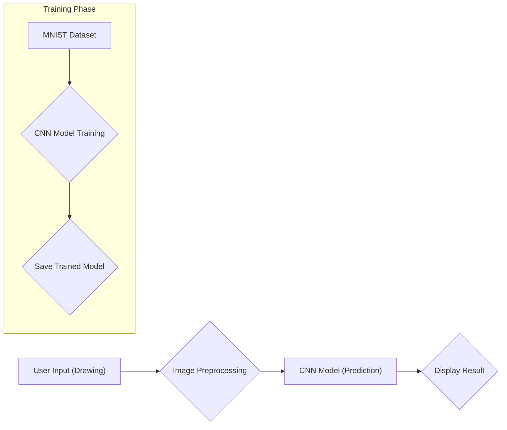

# Handwritten Digit Recognition

This repository provides a complete solution for recognizing handwritten digits using a Convolutional Neural Network (CNN). It includes both model training and a user-friendly GUI for real-time interaction.

## Table of Contents
- [Architecture Overview](#architecture-overview)
- [Technology Stack](#technology-stack)
- [Development Environment Setup](#development-environment-setup)
- [Running the Application](#running-the-application)
- [Training the Model](#training-the-model)
- [Testing](#testing)
- [Dependencies](#dependencies)
- [License](#license)

## Architecture Overview

The project is divided into two main components:

1. **Model Training (`training_model.ipynb`):** A Jupyter Notebook that trains a CNN on the MNIST dataset. It saves the trained model and weights for later use.

2. **Digit Recognition GUI (`handwritten_digit_board.py`):** A Python script that implements a simple GUI using Tkinter. It allows users to draw digits on a canvas and uses the pre-trained CNN model to recognize them in real-time.



## Technology Stack

- **Programming Language:** Python
- **Machine Learning Library:** Keras (with TensorFlow backend)
- **GUI Framework:** Tkinter
- **Image Processing:** OpenCV (cv2)
- **Numerical Computation:** NumPy
- **Others:** Matplotlib (for visualization during training)

## Development Environment Setup

1. **Clone the repository:**
   ```bash
   git clone https://github.com/your-username/handwritten-digit-recognition.git 
   cd handwritten-digit-recognition
   ```

2. **Create a virtual environment (recommended):**
   ```bash
   python -m venv venv
   source venv/bin/activate  
   ```

3. **Install dependencies:**
   ```bash
   pip install -r requirements.txt
   ```

## Running the Application

1. **Make sure you have a trained model (`.h5` file) in the project directory.** If not, follow the steps in the [Training the Model](#training-the-model) section. 

2. **Run the GUI application:**
   ```bash
   python handwritten_digit_board.py 
   ```
   This will open a window where you can draw digits and get predictions.

## Training the Model

1. **Open the `training_model.ipynb` notebook in Jupyter Notebook or Jupyter Lab.**

2. **Run all the cells in the notebook.** 
   - This will train the CNN model on the MNIST dataset, evaluate it, and save the trained model and weights to files.
   - You can adjust the model parameters, epochs, and other training settings in the notebook.

## Testing

The `training_model.ipynb` notebook includes a section for evaluating the trained model's performance on the MNIST test set. You can use this to assess the model's accuracy and loss.

## Dependencies

The required dependencies are listed in the `requirements.txt` file. You can install them using `pip install -r requirements.txt`. 

```
keras
tensorflow
numpy
opencv-python
matplotlib
Pillow
```

## License

This project is licensed under the MIT License - see the [LICENSE](LICENSE) file for details. 
